# GoBus Nigeria - System Diagrams

This document contains all system diagrams for the GoBus Nigeria bus booking platform.

## Table of Contents
1. [Use Case Diagram](#1-use-case-diagram)
2. [Data Flow Diagram (DFD)](#2-data-flow-diagram-dfd)
3. [Entity Relationship Diagram (ERD)](#3-entity-relationship-diagram-erd)
4. [Booking Process Flowchart](#4-booking-process-flowchart)
5. [System Architecture Diagram](#5-system-architecture-diagram)

---

## 1. Use Case Diagram

### 1.1 Actor Definitions

| Actor | Description |
|-------|-------------|
| **Passenger** | End-user who searches and books bus trips |
| **Company Admin** | Bus company owner/manager who manages fleet and trips |
| **System Admin** | Platform administrator with full system access |
| **System** | Automated processes and scheduled tasks |

### 1.2 Complete Use Case Diagram

```mermaid
graph TB
    subgraph Actors
        P[👤 Passenger]
        CA[👔 Company Admin]
        SA[🔧 System Admin]
        SYS[⚙️ System]
    end

    subgraph "Authentication Module"
        UC1[Register Account]
        UC2[Login]
        UC3[Logout]
        UC4[Reset Password]
        UC5[Update Profile]
    end

    subgraph "Trip Search Module"
        UC6[Search Trips]
        UC7[Filter Results]
        UC8[View Trip Details]
        UC9[View Seat Map]
        UC10[Compare Prices]
    end

    subgraph "Booking Module"
        UC11[Select Seats]
        UC12[Enter Passenger Details]
        UC13[Make Payment]
        UC14[View Booking Confirmation]
        UC15[Download E-Ticket]
        UC16[Cancel Booking]
        UC17[View Booking History]
        UC18[Request Refund]
    end

    subgraph "Company Management Module"
        UC19[Register Company]
        UC20[Manage Buses]
        UC21[Manage Routes]
        UC22[Create Trips]
        UC23[Update Trip Status]
        UC24[View Company Bookings]
        UC25[Generate Reports]
        UC26[Update Company Profile]
    end

    subgraph "Admin Module"
        UC27[Manage Users]
        UC28[Manage Companies]
        UC29[Verify Companies]
        UC30[View Analytics]
        UC31[Manage Cities]
        UC32[System Configuration]
    end

    subgraph "System Automated"
        UC33[Expire Pending Bookings]
        UC34[Send Booking Reminders]
        UC35[Update Trip Status Auto]
        UC36[Generate Daily Reports]
    end

    %% Passenger Connections
    P --> UC1
    P --> UC2
    P --> UC3
    P --> UC4
    P --> UC5
    P --> UC6
    P --> UC7
    P --> UC8
    P --> UC9
    P --> UC10
    P --> UC11
    P --> UC12
    P --> UC13
    P --> UC14
    P --> UC15
    P --> UC16
    P --> UC17
    P --> UC18

    %% Company Admin Connections
    CA --> UC2
    CA --> UC3
    CA --> UC5
    CA --> UC19
    CA --> UC20
    CA --> UC21
    CA --> UC22
    CA --> UC23
    CA --> UC24
    CA --> UC25
    CA --> UC26

    %% System Admin Connections
    SA --> UC2
    SA --> UC3
    SA --> UC27
    SA --> UC28
    SA --> UC29
    SA --> UC30
    SA --> UC31
    SA --> UC32

    %% System Automated
    SYS --> UC33
    SYS --> UC34
    SYS --> UC35
    SYS --> UC36
```

### 1.3 Use Case Descriptions

#### Authentication Use Cases

| ID | Use Case | Actor | Description | Preconditions | Postconditions |
|----|----------|-------|-------------|---------------|----------------|
| UC1 | Register Account | Passenger | Create a new user account | None | Account created, verification email sent |
| UC2 | Login | All Users | Authenticate and access system | Valid account exists | User session created |
| UC3 | Logout | All Users | End current session | User is logged in | Session terminated |
| UC4 | Reset Password | Passenger | Request password reset | Valid email exists | Reset link sent to email |
| UC5 | Update Profile | All Users | Modify personal information | User is logged in | Profile updated |

#### Trip Search Use Cases

| ID | Use Case | Actor | Description | Preconditions | Postconditions |
|----|----------|-------|-------------|---------------|----------------|
| UC6 | Search Trips | Passenger | Find available trips | None | List of matching trips displayed |
| UC7 | Filter Results | Passenger | Narrow down search results | Search performed | Filtered results displayed |
| UC8 | View Trip Details | Passenger | See complete trip information | Trip exists | Trip details shown |
| UC9 | View Seat Map | Passenger | See available/booked seats | Trip selected | Seat map displayed |
| UC10 | Compare Prices | Passenger | Compare prices across companies | Multiple trips found | Comparison view shown |

#### Booking Use Cases

| ID | Use Case | Actor | Description | Preconditions | Postconditions |
|----|----------|-------|-------------|---------------|----------------|
| UC11 | Select Seats | Passenger | Choose seats for booking | Trip selected, seats available | Seats temporarily reserved |
| UC12 | Enter Passenger Details | Passenger | Provide passenger information | Seats selected | Passenger info saved |
| UC13 | Make Payment | Passenger | Complete payment transaction | Booking details entered | Payment processed |
| UC14 | View Booking Confirmation | Passenger | See booking summary | Payment successful | Confirmation displayed |
| UC15 | Download E-Ticket | Passenger | Get printable ticket | Booking confirmed | E-ticket generated |
| UC16 | Cancel Booking | Passenger | Cancel an existing booking | Active booking exists | Booking cancelled, refund initiated |
| UC17 | View Booking History | Passenger | See all past bookings | User logged in | Booking list displayed |
| UC18 | Request Refund | Passenger | Request refund for cancellation | Booking cancelled | Refund request submitted |

#### Company Management Use Cases

| ID | Use Case | Actor | Description | Preconditions | Postconditions |
|----|----------|-------|-------------|---------------|----------------|
| UC19 | Register Company | Company Admin | Register new bus company | User account exists | Company pending verification |
| UC20 | Manage Buses | Company Admin | Add/edit/remove buses | Company verified | Bus fleet updated |
| UC21 | Manage Routes | Company Admin | Create/modify routes | Company has buses | Routes configured |
| UC22 | Create Trips | Company Admin | Schedule new trips | Routes exist | Trips scheduled |
| UC23 | Update Trip Status | Company Admin | Change trip status | Trip exists | Status updated |
| UC24 | View Company Bookings | Company Admin | See all bookings for company | Company has trips | Bookings list displayed |
| UC25 | Generate Reports | Company Admin | Create business reports | Bookings exist | Report generated |
| UC26 | Update Company Profile | Company Admin | Modify company information | Company registered | Profile updated |

#### Admin Use Cases

| ID | Use Case | Actor | Description | Preconditions | Postconditions |
|----|----------|-------|-------------|---------------|----------------|
| UC27 | Manage Users | System Admin | View/edit/disable users | Admin logged in | User records updated |
| UC28 | Manage Companies | System Admin | Oversee all companies | Admin logged in | Company records managed |
| UC29 | Verify Companies | System Admin | Approve/reject companies | Pending companies exist | Verification status updated |
| UC30 | View Analytics | System Admin | Access platform statistics | Data exists | Analytics displayed |
| UC31 | Manage Cities | System Admin | Add/edit city database | Admin logged in | Cities updated |
| UC32 | System Configuration | System Admin | Modify system settings | Admin logged in | Settings saved |

---

## 2. Data Flow Diagram (DFD)

### 2.1 Level 0 - Context Diagram

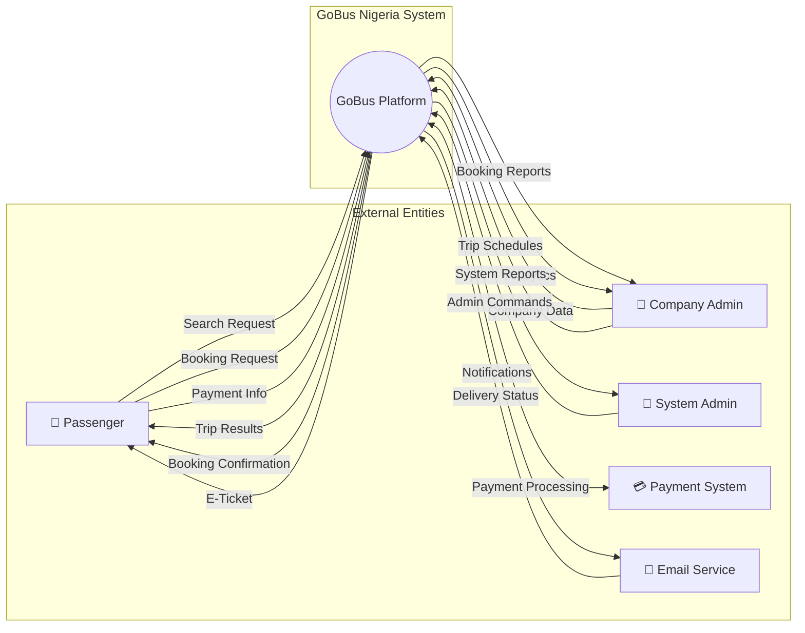

### 2.2 Level 1 - Detailed DFD

```mermaid
graph TB
    subgraph "External Entities"
        P[👤 Passenger]
        CA[👔 Company Admin]
        SA[🔧 System Admin]
        PS[💳 Payment Gateway]
        ES[📧 Email Service]
    end

    subgraph "Processes"
        P1((1.0<br/>User<br/>Management))
        P2((2.0<br/>Trip<br/>Search))
        P3((3.0<br/>Booking<br/>Management))
        P4((4.0<br/>Payment<br/>Processing))
        P5((5.0<br/>Company<br/>Management))
        P6((6.0<br/>Admin<br/>Management))
        P7((7.0<br/>Notification<br/>Service))
    end

    subgraph "Data Stores"
        D1[(D1: Users)]
        D2[(D2: Companies)]
        D3[(D3: Buses)]
        D4[(D4: Routes)]
        D5[(D5: Trips)]
        D6[(D6: Bookings)]
        D7[(D7: Cities)]
        D8[(D8: Passengers)]
    end

    %% User Management Flows
    P -->|Registration Data| P1
    P -->|Login Credentials| P1
    P1 -->|User Token| P
    P1 <-->|User Records| D1

    %% Trip Search Flows
    P -->|Search Criteria| P2
    P2 -->|Available Trips| P
    P2 <-->|Trip Data| D5
    P2 <-->|Route Data| D4
    P2 <-->|City Data| D7
    P2 <-->|Company Info| D2

    %% Booking Management Flows
    P -->|Booking Request| P3
    P -->|Passenger Details| P3
    P3 -->|Booking Confirmation| P
    P3 <-->|Booking Records| D6
    P3 <-->|Passenger Records| D8
    P3 -->|Seat Update| D5
    P3 -->|Payment Request| P4

    %% Payment Processing Flows
    P -->|Payment Data| P4
    P4 <-->|Transaction| PS
    P4 -->|Payment Status| P3
    P4 -->|Receipt| P

    %% Company Management Flows
    CA -->|Company Data| P5
    CA -->|Bus Data| P5
    CA -->|Route Data| P5
    CA -->|Trip Schedules| P5
    P5 -->|Company Reports| CA
    P5 <-->|Company Records| D2
    P5 <-->|Bus Records| D3
    P5 <-->|Route Records| D4
    P5 <-->|Trip Records| D5

    %% Admin Management Flows
    SA -->|Admin Commands| P6
    P6 -->|System Reports| SA
    P6 <-->|All Data Stores| D1
    P6 <-->|Company Verification| D2

    %% Notification Flows
    P3 -->|Booking Notification| P7
    P7 -->|Email Request| ES
    P7 -->|SMS/Push| P
    ES -->|Delivery Status| P7
```

### 2.3 Data Flow Descriptions

| Flow ID | Source | Destination | Data Description |
|---------|--------|-------------|------------------|
| F1 | Passenger | User Management | Registration: name, email, phone, password |
| F2 | User Management | Passenger | Authentication token, user profile |
| F3 | Passenger | Trip Search | Origin, destination, date, passengers count |
| F4 | Trip Search | Passenger | Available trips with prices, times, companies |
| F5 | Passenger | Booking Management | Selected trip, seats, passenger details |
| F6 | Booking Management | Passenger | Booking confirmation, ticket code |
| F7 | Passenger | Payment Processing | Card details, amount, booking reference |
| F8 | Payment Processing | Payment Gateway | Encrypted payment data |
| F9 | Payment Gateway | Payment Processing | Transaction status, reference |
| F10 | Company Admin | Company Management | Company profile, buses, routes, trips |
| F11 | Company Management | Company Admin | Booking reports, analytics, revenue |
| F12 | System Admin | Admin Management | User management, company verification |
| F13 | Booking Management | Notification Service | Booking details for confirmation |
| F14 | Notification Service | Email Service | Email content, recipient |

---

## 3. Entity Relationship Diagram (ERD)

### 3.1 Complete ERD

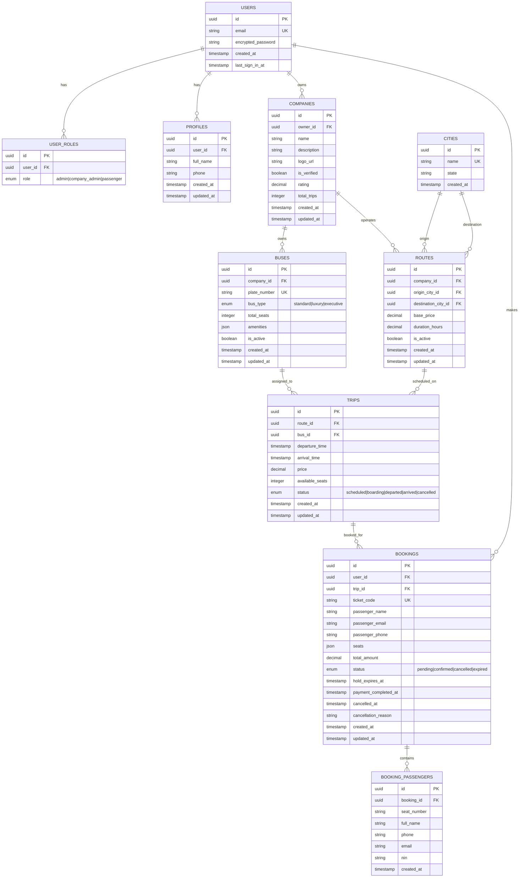

### 3.2 Entity Descriptions

#### Core Entities

| Entity | Description | Key Relationships |
|--------|-------------|-------------------|
| **USERS** | Authentication records from auth system | Parent of PROFILES, USER_ROLES, COMPANIES, BOOKINGS |
| **PROFILES** | Extended user information | Belongs to USERS |
| **USER_ROLES** | Role assignments (admin, company_admin, passenger) | Belongs to USERS |
| **COMPANIES** | Bus company organizations | Belongs to USERS, parent of BUSES, ROUTES |
| **CITIES** | Nigerian cities/destinations | Referenced by ROUTES |
| **BUSES** | Individual bus vehicles | Belongs to COMPANIES, assigned to TRIPS |
| **ROUTES** | Travel routes between cities | Belongs to COMPANIES, parent of TRIPS |
| **TRIPS** | Scheduled bus departures | Belongs to ROUTES and BUSES, parent of BOOKINGS |
| **BOOKINGS** | Customer reservations | Belongs to USERS and TRIPS, parent of BOOKING_PASSENGERS |
| **BOOKING_PASSENGERS** | Individual passenger details per seat | Belongs to BOOKINGS |

### 3.3 Attribute Details

#### USERS Table
| Attribute | Type | Constraints | Description |
|-----------|------|-------------|-------------|
| id | UUID | PK | Unique identifier |
| email | VARCHAR(255) | UNIQUE, NOT NULL | User email address |
| encrypted_password | VARCHAR(255) | NOT NULL | Hashed password |
| created_at | TIMESTAMP | NOT NULL | Account creation time |
| last_sign_in_at | TIMESTAMP | | Last login timestamp |

#### BOOKINGS Table
| Attribute | Type | Constraints | Description |
|-----------|------|-------------|-------------|
| id | UUID | PK | Unique identifier |
| user_id | UUID | FK → USERS | Booking owner |
| trip_id | UUID | FK → TRIPS | Associated trip |
| ticket_code | VARCHAR(20) | UNIQUE | Readable ticket reference |
| passenger_name | VARCHAR(100) | NOT NULL | Primary passenger name |
| passenger_email | VARCHAR(255) | NOT NULL | Contact email |
| passenger_phone | VARCHAR(20) | NOT NULL | Contact phone |
| seats | JSON | NOT NULL | Array of selected seat numbers |
| total_amount | DECIMAL(10,2) | NOT NULL | Total booking cost |
| status | ENUM | NOT NULL | pending/confirmed/cancelled/expired |
| hold_expires_at | TIMESTAMP | | Reservation expiry time |
| payment_completed_at | TIMESTAMP | | Payment confirmation time |
| cancelled_at | TIMESTAMP | | Cancellation time |
| cancellation_reason | TEXT | | Reason for cancellation |

#### BOOKING_PASSENGERS Table
| Attribute | Type | Constraints | Description |
|-----------|------|-------------|-------------|
| id | UUID | PK | Unique identifier |
| booking_id | UUID | FK → BOOKINGS | Parent booking |
| seat_number | VARCHAR(10) | NOT NULL | Assigned seat (e.g., "A1") |
| full_name | VARCHAR(100) | NOT NULL | Passenger full name |
| phone | VARCHAR(20) | NOT NULL | Passenger phone |
| email | VARCHAR(255) | | Passenger email (optional) |
| nin | VARCHAR(20) | | National ID number (optional) |

**CRITICAL CONSTRAINT**: One passenger per seat per trip. Enforced by database trigger `check_seat_availability()`.

---

## 4. Booking Process Flowchart

### 4.1 Complete Booking Flow

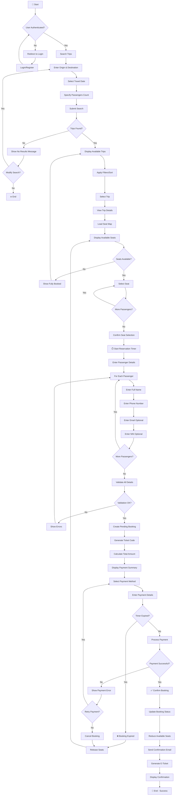

### 4.2 Booking Cancellation Flow

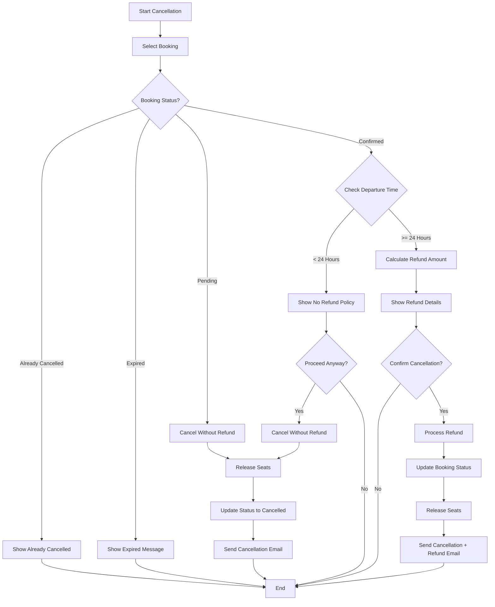

### 4.3 Reservation Timer Logic

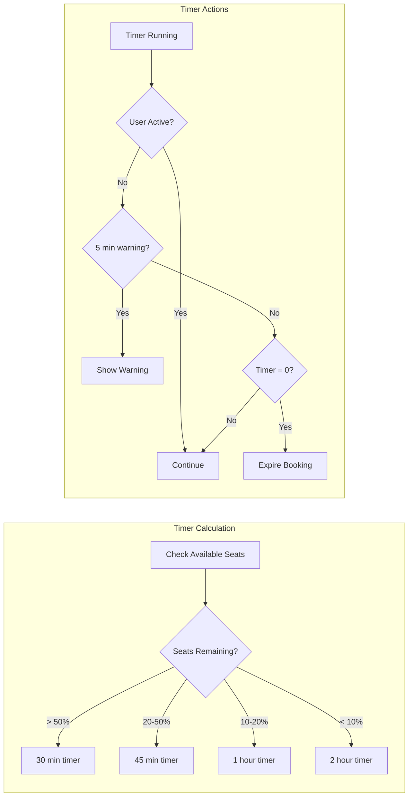

---

## 5. System Architecture Diagram

### 5.1 High-Level Architecture

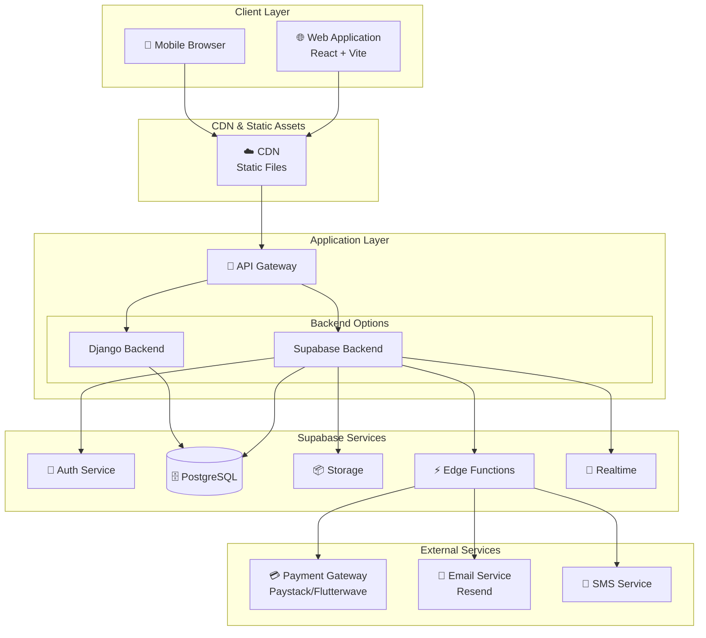

### 5.2 Component Architecture

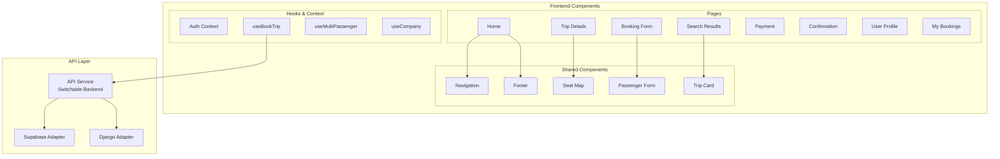

---

## 6. State Diagrams

### 6.1 Booking Status States

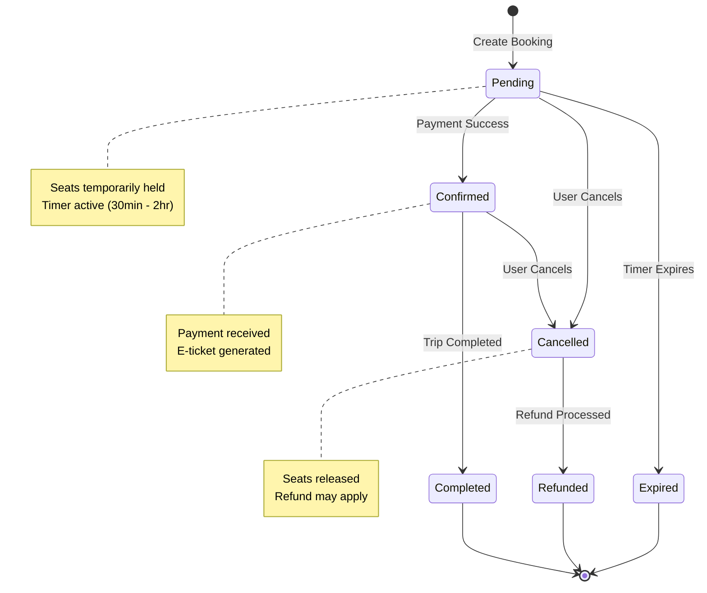

### 6.2 Trip Status States

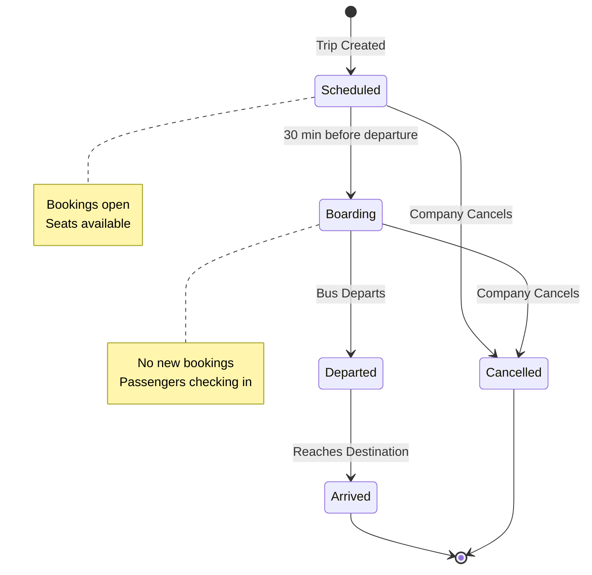

---

## 7. Sequence Diagrams

### 7.1 Booking Creation Sequence

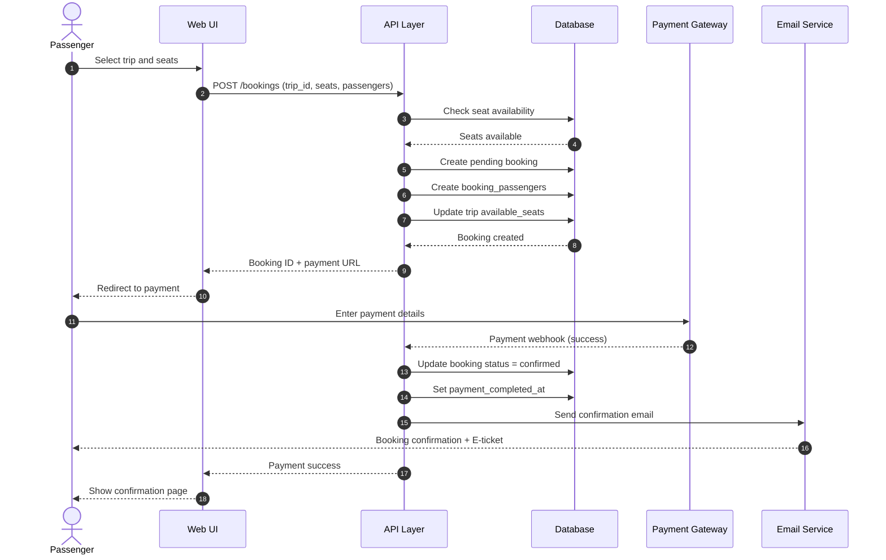

### 7.2 Seat Validation Sequence

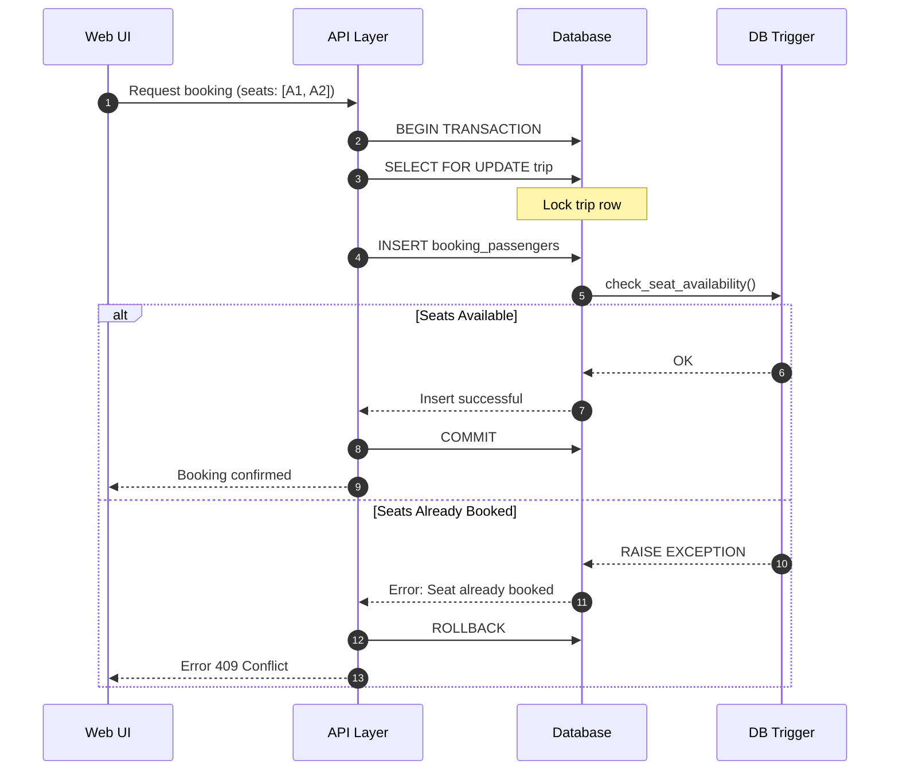

---

## 8. Deployment Diagram

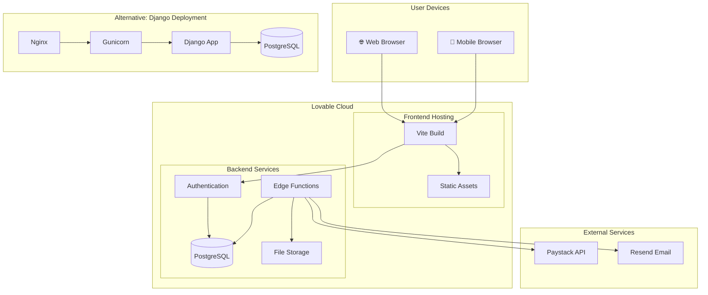

---

## Revision History

| Version | Date | Author | Changes |
|---------|------|--------|---------|
| 1.0 | 2024-01-24 | System | Initial diagram documentation |

---

## Notes

1. **Seat Uniqueness**: The system enforces one passenger per seat per trip through a database trigger (`check_seat_availability`).

2. **Backend Flexibility**: The system supports both Supabase and Django backends, switchable via `VITE_API_BACKEND` environment variable.

3. **Real-time Updates**: Seat availability updates in real-time using Supabase Realtime subscriptions.

4. **Timer-based Reservations**: Pending bookings have dynamic hold times based on trip demand (30 min to 2 hours).
